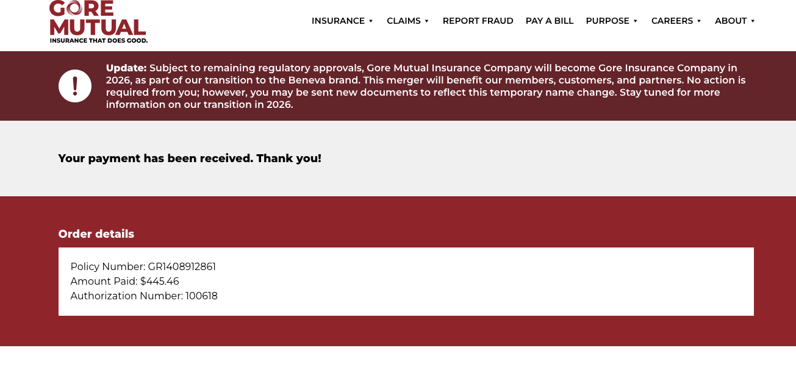

- Gore Mutual Car Insurance Payment - NSF - Resolution for November 2025 Payment
	- Call Maralyn Sobers @ DIS Financial
		- 905-666-2090 ex 221
		  id:: 69299e4a-cdd7-445a-aa3b-cd7caf6cb132
		- 18772760255
			- email sent @8:20
				- Hi Maralyn,
				- Hope you’re doing well.
				- Following up on my previous email — it looks like the payment of **$445.46** to GORE was returned NSF. I now see that a withdrawal attempt was made on the 16th, which explains why another attempt followed.
				- The funds are available now. Could we please process the payment today? I moved money around yesterday to avoid the NSF, but it seems the timing didn’t line up.
				- I’ll give you a call shortly to discuss what we can do to resolve this.
				- Thank you,
				- Jeff
	- Made payment on Gore Mutual website for $446.46 @ 9:05AM
	- Emailed Maralyn the payment confirmation
	- 
-