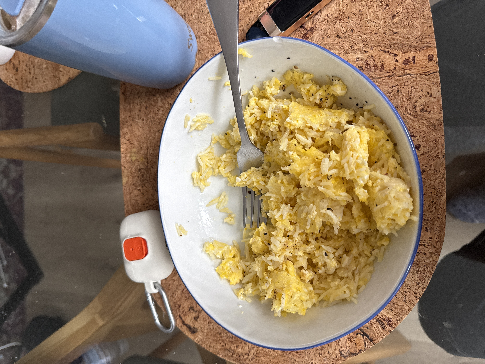

- **2:46 PM** [[BohoBuilder]] Food Log #Log
  - **2:46 PM** [[BohoBuilder]] Food Log #Log
  boho-id:: F984CF9B-E047-466B-B1D6-7A6891F66785
  boho-fingerprint:: 2026-01-03-14-46_food-log
  updated:: 2026-01-03, 2:46 PM
  edited:: 2026-01-03, 4:36 PM
  icon:: fork.knife
  content:: Tracking nutrition for 2026-01-03
  category:: [[Category/Inbox]]
  calories:: 0.0
  - **Food Log:**
    - **4:36 PM** hotdog
    - **4:30 PM** watermelon
    - **4:25 PM** banana
    - **4:21 PM** watermelon
    - **4:18 PM** vinegar
    - **3:41 PM** cookie
    - **3:31 PM** coffee
    - **3:28 PM** green beans
    - **3:21 PM** carrot
    - **3:15 PM** water
    - **3:09 PM** broccoli
    - Congi - Eggs x4 and Rice
    - banana
- **12:24 PM** [[BohoBuilder]] Walk Buda #Log
  boho-id:: 605A0F3D-8BB5-4CBB-81A5-CA7178C8A212
  boho-fingerprint:: 2026-01-03-12-24_walk-buda
  updated:: 2026-01-03, 12:24 PM
  edited:: 2026-01-03, 3:40 PM
  icon:: pawprint.fill
  content:: Frisbee at the park
  category:: [[Category/Dog Diaries]]
- **11:43 AM** [[BohoBuilder]] Mouth Wash #Log
  boho-id:: E4C44E64-B2F7-49EF-890B-597B0EF937EF
  boho-fingerprint:: 2026-01-03-11-43_mouth-wash
  updated:: 2026-01-03, 11:43 AM
  edited:: 2026-01-03, 11:43 AM
  icon:: cart.fill
  category:: [[Category/Groceries]]
  store_name:: Shoppers 
  total_estimated:: $15.0
  budget:: $20.0
- **11:42 AM** [[BohoBuilder]] Groceries  #Log
  boho-id:: EEE1F28D-EDEA-48D5-A695-93B05F163BC2
  boho-fingerprint:: 2026-01-03-11-42_groceries
  updated:: 2026-01-03, 11:42 AM
  edited:: 2026-01-03, 3:40 PM
  icon:: dollarsign.circle
  content:: Mouth Wash
  category:: [[Category/Groceries]]
  budget:: $10.0
  total_estimated:: $10.0
  store_name:: Shoppers Drug Mart
- **11:27 AM** [[BohoBuilder]] Personal #Log
  boho-id:: 40791F21-1789-45C5-8546-00A5CAA7B6D1
  boho-fingerprint:: 2026-01-03-11-27_personal
  updated:: 2026-01-03, 11:27 AM
  edited:: 2026-01-03, 3:40 PM
  icon:: person.fill

    content:: Breakfast 
  category:: [[Category/Personal]]
- **11:00 AM** [[BohoBuilder]] Water plants to do #Log
  boho-id:: A0BBEAAC-773F-4FDF-BC8D-BB3C6573D4E0
  boho-fingerprint:: 2026-01-03-11-00_water-plants-to-do
  updated:: 2026-01-03, 11:00 AM
  edited:: 2026-01-03, 11:14 AM
  icon:: leaf.fill
  content:: Water plants to do
  category:: [[Category/Inbox]]
- **10:56 AM** [[BohoBuilder]] Today's Priorities #Log
  boho-id:: 76B7A652-E314-4804-92A3-8C1922757CD8
  boho-fingerprint:: 2026-01-03-10-56_today's-priorities
  updated:: 2026-01-03, 10:56 AM
  edited:: 2026-01-03, 3:55 PM
  icon:: sparkles
  content:: I will move a lot of and enjoy the day
  category:: [[Category/Reminders]]
  - **Routine Items:**
    - [ ] Clean Kitchen
    - [ ] Empty broken glass from vaccum
    - [x] Shower
- **9:27 AM** [[BohoBuilder]] Donald Trump Venezuela President and Wife Capture #Log
  boho-id:: AA4EE40D-D79B-4001-B456-E54E301AE30F
  boho-fingerprint:: 2026-01-03-09-27_donald-trump-venezuela-president-and-wif
  updated:: 2026-01-03, 9:27 AM
  edited:: 2026-01-03, 3:40 PM
  scheduled:: Jan 3, 2026 at 8:20 PM
  icon:: star.fill
  - Donald Trump says US forces have captured the Venezuelan leader Nicolás Maduro following large-scale strikes in Venezuela.

The US president wrote on social media that Maduro and his wife, First Lady Cilia Flores, had been flown out of the country. Their current whereabouts are unclear.

The Venezuelan defence minister, Vladimir Padrino, has said that the armed forces would defend the country's sovereignty.

The strikes inside Venezuela come after a US pressure campaign against the Maduro government, which the Trump administration accuses of flooding the US with drugs and gang members.

Has Maduro been deposed?
We have little information so far. What Trump has revealed in his social media post is that:

the US has "successfully carried out a large scale strike against Venezuela and its leader"
Maduro and his wife have been captured and flown out of the country
This coupled with the fact that Venezuela's Vice-President Delcy Rodríguez has said that she does not know where Maduro is or whether he is still alive indicates that Maduro has indeed been deposed from office.

However, the Venezuelan defence minister and Rodríguez are still in the country and have appeared on state television, indicating that key members of Maduro's government appear to remain in power.

How did the operation unfold?
There is little detail so far about how the US operation was carried out.

Video footage from inside Venezuela shows large explosions and residents of the capital, Caracas, reported hearing aircraft and blasts.

Smoke could also been seen rising from the different parts of the capital and helicopters could be seen flying in convoy

Several military installations were reportedly hit.

US officials told the BBC's US partner, CBS News, that the strikes had been ordered by the Trump administration.

They also told CBS News that Nicolás Maduro had been captured by the US military's top counter-terrorism unit, the Delta force. But we have no further details about the reported capture so far.

The Venezuelan government confirmed that Caracas had been attacked and said that there had also been strikes in the states of Miranda, La Guaira and Aragua.

US launches 'large-scale strike' on Venezuela and captures President Maduro, Trump says
How did Maduro rise to power?
Reuters Venezuela's President Nicolas Maduro holds Simon Bolivar's sword as he addresses members of the armed forcesReuters
Nicolás Maduro rose to prominence under the leadership of left-wing President Hugo Chávez and his United Socialist Party of Venezuela (PSUV).

Maduro, a former bus driver and union leader, succeeded Chávez and has been president since 2013.

During the 26 years that Chávez and Maduro have been in power, their party has gained control of key institutions including the National Assembly, much of the judiciary, and the electoral council.

In 2024, Maduro was declared winner of the presidential election, even though voting tallies collected by the opposition suggested that its candidate, Edmundo González, had won by a landslide.

González had replaced the main opposition leader, María Corina Machado, on the ballot after she was barred from running for office.

She was awarded the Nobel Peace Prize in October for "her struggle to achieve a just and peaceful transition from dictatorship to democracy".

Machado defied a travel ban and made her way to Oslo in December to collect the award after months in hiding.

She said that she planned to return to Venezuela, a move which would put her at risk of arrest by the Venezuelan authorities, who have declared her a "fugitive".

Nicolás Maduro: The leader who promised to win 'by hook or by crook'
Why has Trump targeted Venezuela?
Trump blames Nicolás Maduro for the arrival of hundreds of thousands of Venezuelan migrants in the US.

They are among close to eight million Venezuelans estimated to have fled the country's economic crisis and repression since 2013.

Without providing evidence, Trump has accused Maduro of "emptying his prisons and insane asylums" and "forcing" its inmates to migrate to the US.

Trump has also focused on fighting the influx of drugs - especially fentanyl and cocaine - into the US.

He has designated two Venezuelan criminal groups - Tren de Aragua and Cartel de los Soles - as Foreign Terrorist Organisations (FTOs) and has alleged that the latter is led by Maduro himself.

Analysts have pointed out that Cartel de los Soles is not a hierarchical group but a term used to describe corrupt officials who have allowed cocaine to transit through Venezuela.

Trump has also doubled the reward for information leading to Maduro's capture and has announced that he would designate the Maduro government as an FTO.

Maduro has vehemently denied being a cartel leader and has accused the US of using its "war on drugs" as an excuse to try to depose him and get its hands on Venezuela's vast oil reserves.

Is Venezuela flooding the US with drugs?
Counternarcotic experts say that Venezuela is a relatively minor player in global drug trafficking, acting as a transit country through which drugs produced elsewhere are smuggled.

Its neighbour, Colombia, is the world's largest producer of cocaine but most of it is thought to enter the US by other routes, not via Venezuela.

According to a US Drug Enforcement Administration (DEA) report from 2020, almost three quarters of the cocaine reaching the US is estimated to be trafficked via the Pacific with just a small percentage coming via fast boats in the Caribbean.

While most of the early strikes the US has carried out were in the Caribbean, more recent ones have focused on the Pacific.

In September, Trump told US military leaders that the boats targeted "are stacked up with bags of white powder that's mostly fentanyl and other drugs, too".

Fentanyl is a synthetic drug which is 50 times more potent than heroin and has become the main drug responsible for opioid overdose deaths in the US.

On 15 December, Trump signed an executive order designating fentanyl as a "weapon of mass destruction", arguing that it was "closer to a chemical weapon than a narcotic".

However, fentanyl is produced mainly in Mexico and reaches the US almost exclusively via land through its southern border.

Venezuela is not mentioned as a country of origin for fentanyl smuggled into the US in the DEA's 2025 National Drug Threat Assessment.

What is Cartel de los Soles, which the US is labelling as a terrorist organisation?
How did we get here?
There has been a build up of pressure on the Maduro government since Trump began his second term in office last January.

First, the Trump administration doubled the reward it offered for information leading to the capture of Maduro.

In September, US forces began targeting vessels it accused of carrying drugs from South America to the US.

There have been more than 30 strikes on such vessels in the Caribbean and the Pacific since then, killing more than 110 people.

The Trump administration argues that it is involved in a non-international armed conflict with the alleged drug traffickers, whom it accuses of conducting irregular warfare against the US.

Legal experts say the strikes are not against "lawful military targets". The first attack - on 2 September - has drawn particular scrutiny as there was not one but two strikes, with survivors of the first hit killed in the second.

A former chief prosecutor at the International Criminal Court told the BBC that the US military campaign more generally fell into the category of a planned, systematic attack against civilians during peacetime.

In response, the White House said it had acted in line with the laws of armed conflict to protect the US from cartels "trying to bring poison to our shores... destroying American lives".

Back in October, Trump said he had authorised the CIA to conduct covert operations inside Venezuela.

He also threatened strikes on land against what he described as "narco-terrorists".

He said that the first of such strikes had been carried out on 24 December, though he gave little detail, just stating that it had targeted a "dock area" where boats alleged to carry drugs where being loaded.

Trump has repeatedly said that Maduro "is no friend of the US" and that it would be "smart for him to go".

He also increased the financial pressure on Maduro by declaring a "total naval blockade" on all sanctioned oil tankers entering and leaving Venezuela. Oil is the main source of foreign revenue for the Maduro government.

The US has also deployed a huge military force in the Caribbean, whose stated aim is to stop the flow of fentanyl and cocaine to the US.

As well as targeting vessels they accuse of smuggling drugs, the force has also played a key role in the US naval blockade.

US strikes on Latin American 'drug boats': What do we know, and are they legal?
How big is the force the US has deployed in the Caribbean?
US Navy/Reuters The US Navy nuclear-powered Ford-class aircraft carrier USS Gerald R. Ford (CVN 78) arrives in St. Thomas, US Virgin IslandsUS Navy/Reuters
The USS Gerald Ford played a key role when the US seized an oil tanker off the Venezuelan coast
The US has deployed 15,000 troops and a range of aircraft carriers, guided-missile destroyers, and amphibious assault ships to the Caribbean.

Among the US flotilla is the USS Gerald Ford, the world's largest aircraft carrier.

US helicopters reportedly took off from it before US forces seized an oil tanker off Venezuela on 10 December.

The US said the tanker had been "used to transport sanctioned oil from Venezuela and Iran". Venezuela described the action as an act of "international piracy".

Since then, the US has targeted two more tankers in waters off Venezuela.

Tracking build-up of US military planes and warships near Venezuela
How much oil does Venezuela export, and who buys it?
Maduro has long accused the Trump administration of attempting to depose him so the US could gain control of Venezuela's oil riches, pointing to a remark Trump made after the US seized the first oil tanker off Venezuela's coast.

When quizzed by reporters as to what would happen with the tanker and its cargo, he said: "I assume we're going to keep the oil."

However, US officials have previously denied Venezuela's allegations that moves against Maduro's government were an attempt to secure access to the country's untapped reserves.

Venezuela has the world's largest proven crude oil reserves and profits from the oil sector finance more than half of the its government budget.

However, its exports have been hit by sanctions and a lack of investment and mismanagement within Venezuela's state-ruin oil company.

In 2023, Venezuela produced only 0.8% of global crude oil, according to the US Energy Information Administration (EIA).

It currently exports about 900,000 barrels per day and China is by far its biggest buyer.

Venezuela says Trump wants its oil. But is that the case?
What we know about US seizure of oil tanker off Venezuela
Nicolás Maduro
Venezuela
Venezuela crisis
Donald Trump
United States
Related
What we know about Maduro's capture
Maduro says Venezuela open to US talks on drug trafficking
Trump says US hit 'big facility' linked to alleged Venezuelan drug boats
More from the BBC
Just now
Sir Keir Starmer talking to BBC reporters
UK 'not involved in any way' in US strike on Venezuela, Starmer says
The PM has not spoken to US President Donald Trump about the US seizure of President Nicolas Maduro.

2 hrs ago
PLumes of smoke rise as the sun comes up on Caracas. 
US captures Maduro after strikes on Venezuelan capital Caracas
Denouncing US military aggression, Venezuela's government has demanded "immediate proof of life" for the president.

3 hrs ago
A street-view image of Iranian shopkeepers and traders protesting on motorbikes and on foot in between cars with tear gas is visible.
Trump warning over Iran protests 'reckless' says foreign minister
The US president earlier said if peaceful protesters are killed, Washington "will come to their rescue".

4 hrs ago
Split screen of reporter in Caracas with explosion to the right hand side 
Reporter in Caracas describes hearing loud bangs and planes
Ana Vanessa Herrero is in Caracas and says she began hearing planes at 02:00 local time.

9 hrs ago
Aerial vision shows orange flames and smoke, surrounded by the red and blue lights of emergency first responders.
Watch: Over 100 firefighters on the scene of Denver blaze
No injuries have been reported as a result of the fire, with the cause still under investigation.

  category:: [[Category/Inbox]]
- **8:43 AM** [[BohoBuilder]] Date  yoga Reagan and her mom #Log
  boho-id:: 34CF148B-D914-4109-9B6C-6C0A9AE78351
  boho-fingerprint:: 2026-01-03-08-43_date--yoga-reagan-and-her-mom
  updated:: 2026-01-03, 8:43 AM
  edited:: 2026-01-03, 3:40 PM
  scheduled:: Jan 3, 2026 at 9:15 AM
  icon:: mic.fill
  content:: Date today 9:15 AM yoga Reagan and her mom
  category:: [[Category/Inbox]]
- **8:39 AM** [[BohoBuilder]] Daily Routine #Log
  boho-id:: 4A2ED0A6-D751-4F45-B16B-8917BB7F489A
  boho-fingerprint:: 2026-01-03-08-39_daily-routine
  updated:: 2026-01-03, 8:39 AM
  edited:: 2026-01-03, 3:40 PM
  scheduled:: Jan 3, 2026 at 12:00 PM
  icon:: checkmark.circle.fill
  content:: Tracking progress for 2026-01-03
  category:: [[Category/Routine]]
  completion_rate:: 0%
    - [ ] Take vitamins
    - [ ] Walk
    - [ ] Water
- **3:41 PM** [[BohoBuilder]] Cookie #Log
  boho-id:: 1A727F41-7E1B-442B-AF4D-83D6F3A43FFF
  boho-fingerprint:: 2026-01-03-15-41_cookie
  updated:: 2026-01-03, 3:41 PM
  edited:: 2026-01-03, 3:41 PM
  icon:: mic.fill
  content:: Cookie
  category:: [[Category/Inbox]]
- **4:37 PM** [[BohoBuilder]] Test #Log
  boho-id:: ED3A1D07-9A73-4359-A691-EE6357865A01
  boho-fingerprint:: 2026-01-03-16-37_test
  updated:: 2026-01-03, 4:37 PM
  edited:: 2026-01-03, 4:37 PM
  icon:: mic.fill
  content:: Test
  category:: [[Category/Inbox]]