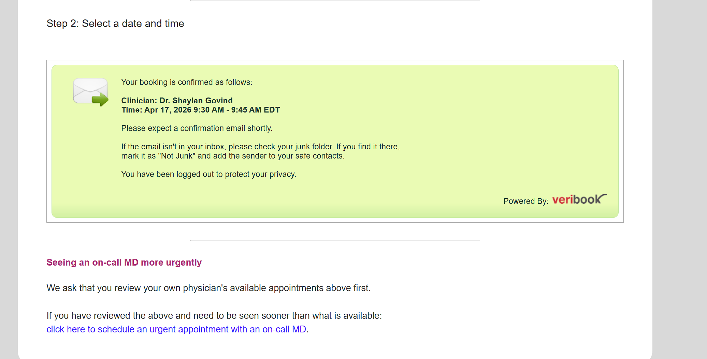
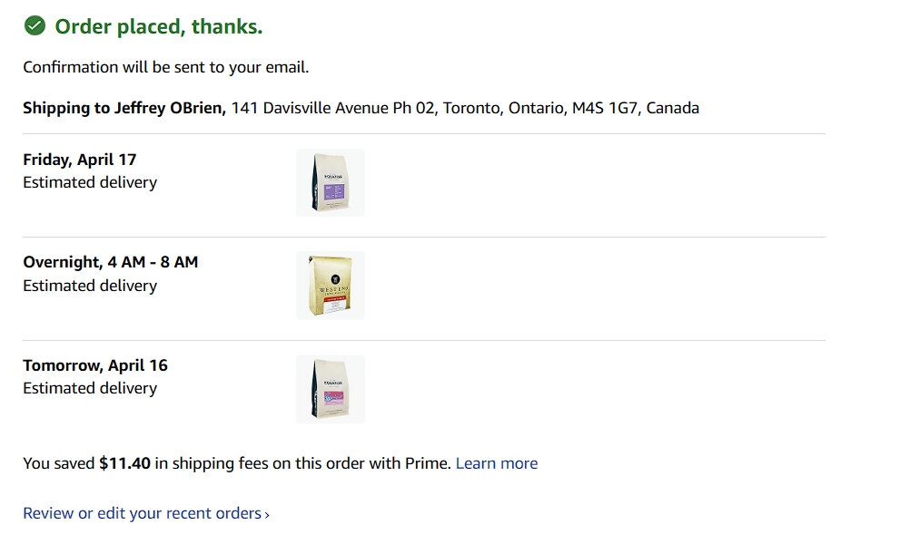

- Paid Wyse Meter Utility - $75
- Paid SpotHero - $150
- Submitted Trillium Invoice from Mar 19, 2026 appointment 175
- DONE set appointment with Dr. Govin
  collapsed:: true
	- 
		- Appointment by phone set for April 17 at 9:30 for a follow up on my x ray results
		- Your Booking with Magenta Health Is Confirmed
		  SCHEDULED: <2026-04-17 Fri 9:15>
		  Magenta Health<noreply@veribook.com>
		  ​You​
		  Dear Jeff O'Brien,
		  
		  Thank you for requesting a booking. It has been confirmed.
		  
		  To cancel or change your booking, please use the following link:
		  https://veribook.com/main.jsp?viewAppntRequest=4420420
		  
		  Details of your booking are as follows:
		  --------------------
		  Date:          Friday, April 17, 2026
		  Time:          9:30 AM - 9:45 AM (Eastern Daylight Time)
		  Clinician:     Dr. Shaylan Govind
		  Phone Number:  6479154609
		  --------------------
		  
		  --------------------
		  Special Notes:
		  --------------------
		  
		  NEW MANDATORY VIRTUAL CHECK IN PROCESS
		  
		  Please check-in for your phone appointment 5 - 10 minutes early using the following link: www.magentahealth.ca/418-remote-checkin   You will not be called until you check in.
		  
		  Once you are checked in, you'll be able to view your approximate wait-time. Your physician may be running behind, for example, if a prior appointment runs long due to an unexpectedly complex issue. Please give yourself some buffer time.
		  
		  RECEIVING CALLS
		  
		  The call will likely come from an UNKNOWN, PRIVATE, or BLOCKED number. Please ensure your phone is configured to accept these calls, does not automatically send these calls to voicemail, and pick up these calls during this time frame. If you miss the call, there will not be a call back number that you can use, you will need to reschedule.
		  
		  CANCELLING / RESCHEDULING
		  
		  Please show consideration to your fellow patients by cancelling and rescheduling appointments as early as possible if you no longer require an appointment or can no longer attend. Appointments cancelled or rescheduled less than 12 hours in advance may be subject to a fee: http://www.magentahealth.ca/uninsured-services-and-block-fees
		  
		  -------------------------------------------
		  
		  For your convenience we have included the file "booking.ics" for you to add this appointment to a third-party calendar.
		  
		  Best regards,
		  Magenta Health
		  
		  How to manage appointments: https://medical.veribook.com/manage-your-appointments
		  
		  Magenta Health FAQ and Contact Info: https://www.magentahealth.ca/contact/
		  
		  ---------------------------------------------------
		  
		  Help us keep building better tools for better care.
		  Join our Circle of Supporters:
		  https://www.magentahealth.ca/better-care-2
- DONE follow-up on Physiotherapy referral
	- WAITING I left a voicemail with Strive Physiotherapy to return my call about a referral appointment
- Ordered Coffee
  collapsed:: true
	- 
	-
- 11:02 Back from walking buda and playing frisbee at the park
- 10:30 - Dropped off UPS Dell Dock
- Ordered from Merton 3 concentrates 175
- DONE Change address with Cap One
-