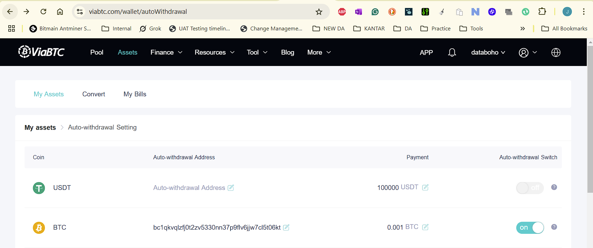
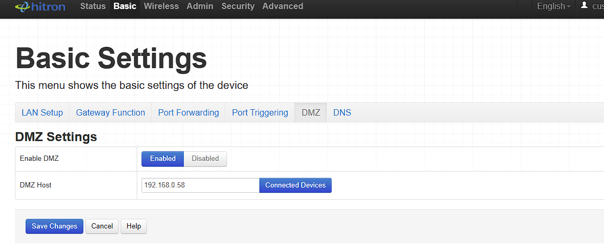
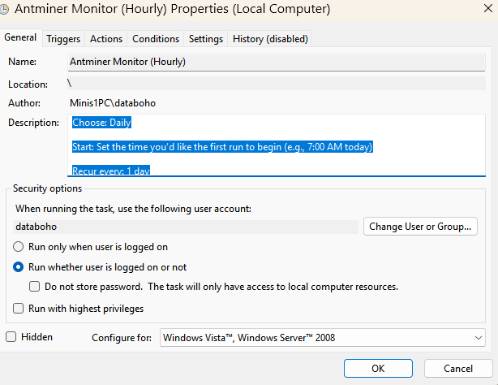
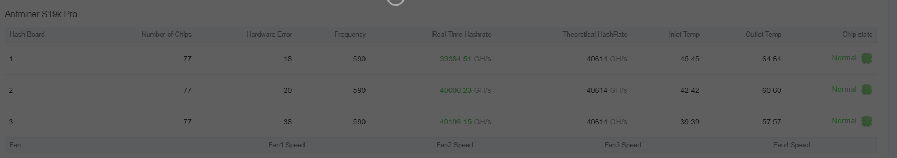
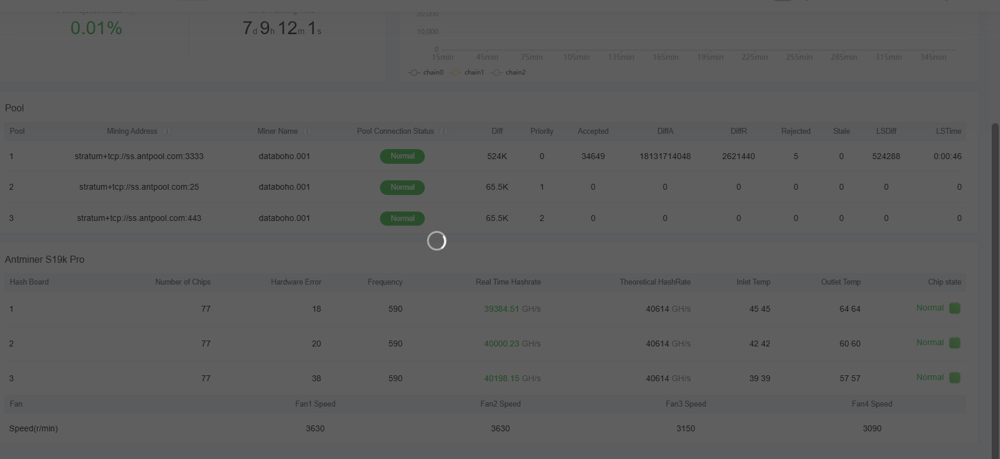

- Use Advanced IP Finder app
- enter IP in the browser
	- Login: root
	- Password: root
-
	- CoinbaseWallet address: ***(using this one on ViaBTC)***
		- bc1qkvqlzfj0t2zv5330nn37p9flv6jjw7cl5t06kt
- Coinbase address to receive bitcoin:
	- 35ywWFjxnyGb93WcK8AUK7muHxgCeF8Kxe
-
- Power Cord
	- G3/T5023.5-2008 3c.75mm 300-500V 50227 AC50951
-
- 13:32 [[Feb 28th, 2025]] POWERED UP THE MINER FOR FIRST TIME
	- Running Advanced IP Finder App to get miner IP
	- IP: On	Antminer.ht.home	192.168.0.58
	- DB Level: 77.3db at unit, 50db at desk (487hz-2khz)
	- Sign Up for Mining pool
		- https://www.viabtc.com/
			- databoho
			- Gr9mmmm9%%
				-
				- **Miner Configuration Example**
				- Recommended
				- Pool 1 URL stratum+tcp://btc.viabtc.io:3333
				- Pool 2 URL stratum+tcp://btc.viabtc.io:25
				- Pool 3 URL stratum+tcp://btc.viabtc.io:443
				- Worker databoho.001
				- Password 123
			- Payment Password 133113
		- Setup auto-withdrawls for BTC on ViaBTC to coinbase wallet
			- 
				- Completed [[Mar 1st, 2025]] 10:37am
			- Day 16 = 
			- [[Mar 3rd, 2025]] @ 8:23AM Restart Miner
				- Before restart 7 and 8 hardware errors
	- [[Mar 4th, 2025]] @ 7:46 AM Factory Reset Miner due to losing the login credentials.
		- Miner Login Credentials
		- ### Login: root
		- ### Password: Gr9mmmm9%%
	- [[Mar 9th, 2025]] @ 15:51
		- changed miner config to start using hashboards, rather than just one.
		- Added names databoho.002 and databoho.003 as miners for the same ip
			- I may need to change the ip or port
		- Restarting Miner  at 15:53
- [[Mar 11th, 2025]] @ 8:45am - Put the miner in the original box, surrounded by soundproofing and cut holes for ventilation. Testing to see if it runs the same and if it is quieter.
	- [[Mar 14th, 2025]] It does run just as well and it is quieter
- [[Mar 17th, 2025]] @ 7:55am - Restarted Miner and renamed miners in backup pools from databoho.001, 002, 003 -- To databoho.001, databoho.001, databoho.001.
- [[Mar 17th, 2025]] pool mining assets reached .001 (approx $120 CAD) and was auto transferred to my Coinbase bitcoin wallet.
- [[Mar 19th, 2025]] @ 3:46pm Shutdown Miner for 5 mins while I repositioned it against the air conditioner, and now have the warm air going directly out the door. Rather than the other way around. I chose to do this as the fan were working much harder (louder) than usual. The fans are now running at their near quietest ever. The reason for the change today was due to a rise in the outdoor temp from 0 to 19 degrees celcius. A good test that shows we are in pretty good shape for most of the summer months.
	- | Fan | Fan1 Speed | Fan2 Speed | Fan3 Speed | Fan4 Speed |
	  | ---- | ---- | ---- | ---- | ---- | ---- |
	  | Speed(r/min) | 4000 | 4000 | 3780 | 3720 |
- [[Mar 20th, 2025]] @ 11:08am I restarted the miner after seeing a lot of stale or rejected items. This seemed to corespond with the installation of the FM2+, which I am testing.
- [[Mar 25th, 2025]] @3:20 PM Set miner to 'High Power Mode' in response to bitcoin prices being up 10%
	- Test for 24 hours and see outcome
	- **12:09** [[quick capture]]:  [ViaBTC | BTC Pool Home](https://www.viabtc.com/pool/state#)
- [[Mar 27th, 2025]] Returned AntMiner to 'Normal' mode, a change from 'High Energy Mode' after testing.
	- Results were approximately earning $1 more per day
	- Not enough compared to how much the Miner is working.
	- Fans are a lot louder and it's not worth the return
	- Machine components will also last longer in 'Normal' mode
- [[Mar 28th, 2025]] Assigned AntMiner to DMZ in router settings, allowing direct access to the internet with less routing.
	- {:height 254, :width 604}
- [[Mar 29th, 2025]] AM the miner went off line from the pool. Could not get it to reconnect. Factory reset the miner and reset the password and took it out of DMZ, and put it in static IP mode on both the miner and the router
	- Backup pool 3 is showing as 'abnormal'
	- otherwise all good
- Login: root
  background-color:: green
- Password: 1331
  background-color:: green
-
- Set up Automonitor Script:
  C:\Users\databoho\OneDrive\Documents\MyScripts\AntMiner_Monitor.py
- Called by Windows Task Scheduler: Antminer Monitor 
- Set up Weekly Report Generator: C:\Users\databoho\OneDrive\Documents\MyScripts\AntMiner_Weekly_Report.py
- [[Apr 8th, 2025]] Removed all sound baffling from Miner and placed it on it's side, close to the back door on the floor. Temp outside = -5 Celsius
- [[Apr 9th, 2025]]@10:05 - Changed the Fan Speed from 100% to 10%
-
- [[Apr 12th, 2025]] @10:49 switched mining pool from viabtc to antpool
	- [[Antpool]] Login
		- Login: databoho@gmail.com
		- Pass: Gr9mmmm9%
		- https://v3.antpool.com/dashboard
- [[Apr 12th, 2025]] @ 10:45 - Transferred $60 in BTC from ViaBTC to Wallet bc1qkvqlzfj0t2zv5330nn37p9flv6jjw7cl5t06kt #transaction
- [[Apr 12th, 2025]] @11:10 Restarted Miner
- Column Value Definitions Antminer Dashboard
- ### 🧾  **Antminer Pool Status - Column Definitions**
  
  | Column | Meaning |
  | ---- | ---- | ---- |
  | **Pool** | The index number (1–3), indicating order of priority. Pool 1 is the primary. |
  | **Mining Address** | The stratum URL used to connect to the mining pool (e.g., `stratum+tcp://...`). |
  | **Miner Name** | The worker name you assigned, usually `subaccount.worker` (e.g., `databoho.001`). |
  | **Pool Connection Status** | Connection health — shows `Normal` if connected properly. |
  | **Diff** | The mining difficulty level the pool assigned to your miner. |
  | **Priority** | Pool priority: 0 = Primary, 1 = First backup, 2 = Second backup. |
  | **Accepted** | Number of valid shares submitted to the pool and accepted. |
  | **DiffA** | Cumulative difficulty of accepted shares. Indicates total work done. |
  | **DiffR** | Cumulative difficulty of **rejected** shares (should ideally be 0). |
  | **Rejected** | Total number of invalid or stale shares rejected by the pool. |
  | **Stale** | Number of stale shares (submitted too late to be counted). Should be 0. |
  | **LSDiff** | Last Share’s difficulty (last share’s contribution). |
  | **LSTime** | Time since the **last valid share** was submitted (should be a few seconds if healthy). |
- [[Apr 16th, 2025]] @ 6:38am changed fan speeds to 50% and restarted miner. Temp is cool outside. Reducing fan noise.
- [[Apr 16th, 2025]] @ 7:00 restarted miner with fans at 15%
- [[Apr 18th, 2025]] @ 10:42 Changed mining pool back to ViaBTC. Seems more profitable.
- [[Apr 18th, 2025]] @ 4:14 Switched back to AntPool, since I cannot withdraw funds until I reach the min .005 BTC. 2.5 months or so...
- [[Apr 20th, 2025]] Restarted miner to set fans. No override. Just normal setting... Auto
- [[Apr 26th, 2025]]@ 7:01 PM EST Switched back to VIA BTC after thinking my returns seem lower on ANTPOOL. Plus I need to wait another 70 days to withdrawl funds from ANTPOOL -
- [[May 12th, 2025]] Switched back to AntPool to get 2 months more of payouts asap.
- [[May 20th, 2025]] @5:21 Restarting miner to clear board errors
	- 
	- {:height 219, :width 459}
	- GPT Analysis
		- Here's a full health analysis and performance breakdown of your Antminer S19k Pro, based on the dashboard stats you provided after 7 days 9 hours of continuous operation:
		  
		  🔧 Performance Overview
		  Metric	Value	Analysis
		  Real-Time Hashrate	122,947 GH/s	Excellent — Exceeds nominal spec (120 TH/s)
		  Avg Total Hashrate	122,159 GH/s	Excellent — Consistent uptime/performance
		  Uptime	7d 9h 6m 31s	Great — Long stable run with no reboot
		  Pool Rejection Rate	0.01%	Outstanding — Very low rejection, almost no wasted effort
		  Fan Speeds	3660 / 3630 / 3150 / 3090 RPM	Normal — Suggests balanced thermal load and good airflow
		  Temperatures	Inlet: 39–45°C, Outlet: 57–64°C	Very Good — Below danger thresholds
		  
		  📦 Hash Board Details
		  Each of the three hashboards has 77 chips, which is normal for the S19k Pro.
		  
		  Hash Board	Hashrate (Real)	Hashrate (Theoretical)	Hardware Errors	Temp (In/Out)	Chip State
		  1	40,703.92 GH/s	40,614 GH/s	18	45°C → 64°C	Normal
		  2	41,209.69 GH/s	40,614 GH/s	20	43°C → 60°C	Normal
		  3	41,187.71 GH/s	40,614 GH/s	38	39°C → 57°C	Normal
		  
		  ✅ Interpretation:
		  
		  Slightly above-spec performance on all boards, which is great.
		  
		  Hashboard 3 has the most hardware errors (38), but still within acceptable range. If errors trend upward, monitor it or clean contacts.
		  
		  Temps are under 70°C outlet — safe zone for ASIC longevity.
		  
		  All 77 chips on each board are online and accounted for.
		  
		  🌐 Pool Connections
		  Pool (Priority)	Status	Accepted Shares	Rejected	Notes
		  1 (Port 3333)	Normal	34630	5	Main active pool
		  2 (Port 25)	Normal	0	0	Backup
		  3 (Port 443)	Normal	0	0	Backup
		  
		  Main pool (Port 3333) is running well with very low rejection.
		  
		  Backups show no action — expected in normal redundancy setups.
		  
		  📊 Key Observations
		  ✅ Excellent hashrate — Your unit is producing well above the 120 TH/s rating.
		  
		  ✅ Temps & Fan Speeds — Healthy range; no overheating.
		  
		  ✅ Stability — Continuous run > 7 days with no reboots or issues.
		  
		  ⚠️ Hardware Errors on Board 3 — Worth tracking if they rise above 50 over time.
		  
		  🛠️ Recommendations
		  🔁 Clean every 4–6 weeks (especially intake fans and filters) to keep temps consistent.
		  
		  📉 Log hardware errors daily — if one board begins erroring heavily or drops hashrate, it could indicate aging or bad chips.
		  
		  🌡️ Monitor summer ambient temps — consider improving airflow if temps creep over 70°C outlet.
		  
		  Would you like me to generate a daily or weekly tracker Excel file for this unit, with charts for:
		  
		  Hashrate
		  
		  Fan Speeds
		  
		  Temperatures
		  
		  Hardware Errors per Board?
		  
		  Let me know — we can automate it too.
		  
		  
		  
		  
		  
		  
		  
		  You said:
		  Thanks. As for the hardware errors on board 3, if  I dont reboot. They will no doubt increase to 50 and beyond, if my thinking is correct
		  
		  
		  ChatGPT said:
		  You're exactly right — and your thinking is on point.
		  
		  🔁 What Happens with Persistent Hardware Errors on Board 3
		  If you don’t reboot, here’s the likely scenario:
		  
		  Error Accumulation:
		  Hardware errors tend to increment over time, especially on boards showing early signs of instability (like Board 3 here with 38 errors already). It’s not just a reset count — it's a sign of either:
		  
		  Aging chips
		  
		  Thermal fluctuations
		  
		  Dust buildup
		  
		  Power delivery inconsistency
		  
		  Hashrate Instability or Drop:
		  If the error rate passes a certain threshold (often 50–60 errors), the board may begin to throttle performance, or the miner's firmware may auto-disable affected chips or the entire board to protect itself.
		  
		  Possible Long-Term Degradation:
		  Repeated high-error states without rebooting or cleaning may shorten the life of the chips on that board.
		  
		  ✅ What You Can Do Now
		  🧹 Quick Check & Preventive Steps
		  Airflow check — Blow compressed air into the intake to dislodge dust that might be causing spot heating.
		  
		  Visual inspection — If you can safely do so, check that the thermal pads/fins aren’t blocked.
		  
		  Ambient check — Is Board 3 closer to a wall or heat source? Positioning can matter.
		  
		  🔄 Reboot Benefits
		  A simple reboot often:
		  
		  Clears error counters
		  
		  Resets voltage/frequency tuning
		  
		  Allows chips to cool and reset safely
		  
		  So yes — a scheduled reboot every 7–10 days can be a smart, non-invasive way to help stabilize hardware error accumulation.
		  
		  Would you like an automatic alert if Board 3 crosses a set threshold (say 45 errors), or a script that schedules a reboot every X hours? Happy to help build that.\
	- [[May 23rd, 2025]] received a notice from RPMS regarding using AC prior to June 1.
		- This made me shutdown the miner for now.
		- 11:04 AM